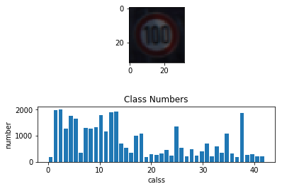
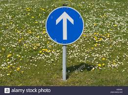
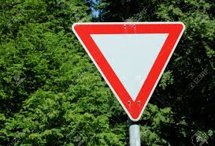
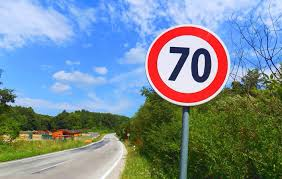
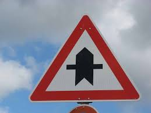

# **Traffic Sign Recognition** 

## Writeup

**Build a Traffic Sign Recognition Project**

The goals / steps of this project are the following:
* Load the data set (see below for links to the project data set)
* Explore, summarize and visualize the data set
* Design, train and test a model architecture
* Use the model to make predictions on new images
* Analyze the softmax probabilities of the new images
* Summarize the results with a written report

## Rubric Points
### Here I will consider the [rubric points](https://review.udacity.com/#!/rubrics/481/view) individually and describe how I addressed each point in my implementation.  

---
###

### Data Set Summary & Exploration

#### 1. Provide a basic summary of the data set. In the code, the analysis should be done using python, numpy and/or pandas methods rather than hardcoding results manually.

I used the pandas library to calculate summary statistics of the traffic
signs data set (data set address https://s3-us-west-1.amazonaws.com/udacity-selfdrivingcar/traffic-signs-data.zip):

* The size of training set is 34799
* The size of the validation set is 4410
* The size of test set is 12630
* The shape of a traffic sign image is (32, 32, 3)
* The number of unique classes/labels in the data set is 43

#### 2. Include an exploratory visualization of the dataset.

Here is an exploratory visualization of the data set. It is a picture showing one of the train data and the count of each sign in train data set.

### Design and Test a Model Architecture

#### 1. Describe how you preprocessed the image data. What techniques were chosen and why did you choose these techniques? Consider including images showing the output of each preprocessing technique. Pre-processing refers to techniques such as converting to grayscale, normalization, etc. (OPTIONAL: As described in the "Stand Out Suggestions" part of the rubric, if you generated additional data for training, describe why you decided to generate additional data, how you generated the data, and provide example images of the additional data. Then describe the characteristics of the augmented training set like number of images in the set, number of images for each class, etc.)

As first step, I normalized the image data so that the data has mean zero and equal variance

For image data, (pixel - 128)/ 128 is a quick way to approximately normalize the data and can be used in this 

project

#### 2. Describe what your final model architecture looks like including model type, layers, layer sizes, connectivity, etc.) Consider including a diagram and/or table describing the final model.

My final model consisted of the following layers:

| Layer         		|     Description	        					| 
|:---------------------:|:---------------------------------------------:| 
| Input         		| 32x32x3 RGB image   							| 
| Convolution 5x5     	| 1x1 stride, valid padding, outputs 28x28x16 	|
| RELU					|												|
| Max pooling 2x2	    | 2x2 stride, valid padding, outputs 14x14x16 	|
| Convolution 5x5	    | 1x1 stride, valid padding, outputs 10x10x32   |
| RELU					|												|
| Max pooling 2x2	    | 2x2 stride, valid padding, outputs 5x5x32 	|
| Fully connected		| input 5x5x32, output 400        			    |
| RELU					|												|
| Fully connected		| input 400, output 200        			        |
| RELU					|												|
| Dropout               | keep_prob 0.6                                 |
| Fully connected		| input 200, output 100        			        |
| RELU					|												|
| Dropout               | keep_prob 0.6                                 |
| Fully connected logits| input 100, output 43        			        |

 

#### 3. Describe how you trained your model. The discussion can include the type of optimizer, the batch size, number of epochs and any hyperparameters such as learning rate.

To train the model, I used EPOCHS = 10, BATCH_SIZE =128, rate = 0.001, keep_prob = 0.6

#### 4. Describe the approach taken for finding a solution and getting the validation set accuracy to be at least 0.93. Include in the discussion the results on the training, validation and test sets and where in the code these were calculated. Your approach may have been an iterative process, in which case, outline the steps you took to get to the final solution and why you chose those steps. Perhaps your solution involved an already well known implementation or architecture. In this case, discuss why you think the architecture is suitable for the current problem.

My final model results were:
* training set accuracy of 0.997
* validation set accuracy of 0.959 
* test set accuracy of 0.942

If an iterative approach was chosen:
* What was the first architecture that was tried and why was it chosen? 
* LeNet-5 was chosen first due to the good performance in MNIST CNN project
* What were some problems with the initial architecture?
* The initial architecture can not get a high accuracy
* How was the architecture adjusted and why was it adjusted? 
* Based on LeNet-5, adding one more fully connected layer to make the layers deeper to get better behavior. And add two more dropout layers to prevent overfitting . 
* Which parameters were tuned? How were they adjusted and why?
* The filter deepth/output size were tuned to get more information when training
* What are some of the important design choices and why were they chosen? 
* a convolution layer work well with this problem due to share our parameters and help us not only with translation invariance, but also gives us a smaller, more scalable model. Another is Dropout, which is a regularization technique for reducing overfitting. The technique temporarily drops units (artificial neurons) from the network, along with all of those units' incoming and outgoing connections. 

If a well known architecture was chosen:
* What architecture was chosen?
* LeNet-5 based architecture was chosen
* Why did you believe it would be relevant to the traffic sign application?
* LeNet-5 used for MNIST successfully, there have some similarity between traffic signs and MNIST
* How does the final model's accuracy on the training, validation and test set provide evidence that the model is working well?
* Both training and validation set are high, and test set are not the part of training set, it is new for the architecture, and the test accuracy is about 0.95 which is close to training and validation accuracy.
 

### Test a Model on New Images

#### 1. Choose five German traffic signs found on the web and provide them in the report. For each image, discuss what quality or qualities might be difficult to classify.

Here are five German traffic signs that I found on the web:

Those images might be difficult to classify because the backgrounds of those images are not pure.

#### 2. Discuss the model's predictions on these new traffic signs and compare the results to predicting on the test set. At a minimum, discuss what the predictions were, the accuracy on these new predictions, and compare the accuracy to the accuracy on the test set (OPTIONAL: Discuss the results in more detail as described in the "Stand Out Suggestions" part of the rubric).

Here are the results of the prediction:

| Image			        |     Prediction	        					| 
|:---------------------:|:---------------------------------------------:| 
| No entry      		| No entry   									| 
| Ahead only     		| Ahead only									|
| Yield					| Yield											|
| Speed limit (70km/h)	| Speed limit (70km/h)					 		|
| Right-of-way at the next intersection| Right-of-way at the next intersection|

The model was able to correctly guess 5 of the 5 traffic signs, which gives an accuracy of 100%. This compares favorably to the accuracy on the test set of 95%.

#### 3. Describe how certain the model is when predicting on each of the five new images by looking at the softmax probabilities for each prediction. Provide the top 5 softmax probabilities for each image along with the sign type of each probability. (OPTIONAL: as described in the "Stand Out Suggestions" part of the rubric, visualizations can also be provided such as bar charts)

The code for making predictions on my final model is located in the 11th cell of the Ipython notebook.

For the first image, the model is relatively sure that this is a No entry (probability of 1), and the image does contain a No entry. The top five soft max probabilities were

| Probability         	|     Prediction	        					| 
|:---------------------:|:---------------------------------------------:| 
| 1.00000000e+00        | No entry   									| 
| 6.44436261e-21        | Speed limit (20km/h)              			|
| 2.57283422e-21		| Stop											|
| 1.41477658e-26	    | Traffic signals    					 		|
| 4.51580543e-30		| Speed limit (120km/h)      				    |

For the second image , the model is relatively sure that this is a Ahead only (probability of 1), and the image does contain a Ahead only. The top five soft max probabilities were

| Probability         	|     Prediction	        					| 
|:---------------------:|:---------------------------------------------:| 
| 1.00000000e+00        | Ahead only   									| 
| 1.61767768e-22        | Turn left ahead 			                    |
| 2.86485188e-23		| Go straight or left							|
| 1.02383015e-25	    | Turn right ahead  					 		|
| 2.98958007e-26		| Go straight or right                          |

For the third image , the model is relatively sure that this is a Yield (probability of 1), and the image does contain a Yield. The top five soft max probabilities were

| Probability         	|     Prediction	        					| 
|:---------------------:|:---------------------------------------------:| 
| 1.00000000e+00        | Yield     									| 
| 3.82214547e-24        | Speed limit (60km/h) 			                |
| 2.11509238e-25		| No passing    								|
| 2.40388971e-27	    | No vehicles       					 		|
| 1.50016028e-28		| Keep right                                    |

For the forth image , the model is relatively sure that this is a Speed limit (70km/h) (probability of 1), and the image does contain a Speed limit (70km/h). The top five soft max probabilities were

| Probability         	|     Prediction	        					| 
|:---------------------:|:---------------------------------------------:| 
| 1.00000000e+00        | Speed limit (70km/h)  						| 
| 1.17027536e-13        | Speed limit (20km/h)			                |
| 4.81497827e-15		| Speed limit (30km/h)						    |
| 5.48070164e-22	    | Speed limit (80km/h)					 		|
| 1.17454944e-23		| Speed limit (120km/h)                         |

For the fiveth image , the model is relatively sure that this is a Right-of-way at the next intersection (probability of 1), and the image does contain a Right-of-way at the next intersection. The top five soft max probabilities were

| Probability         	|     Prediction	        					| 
|:---------------------:|:---------------------------------------------:| 
| 1.00000000e+00        | Right-of-way at the next intersection         | 
| 1.33079571e-17        | Beware of ice/snow			                |
| 4.74273116e-24		| Priority road  								|
| 2.00868034e-25	    | End of no passing by vehicles over 3.5 metric tons|
| 8.08240383e-26		| Double curve                                  |

### (Optional) Visualizing the Neural Network (See Step 4 of the Ipython notebook for more details)
#### 1. Discuss the visual output of your trained network's feature maps. What characteristics did the neural network use to make classifications?

